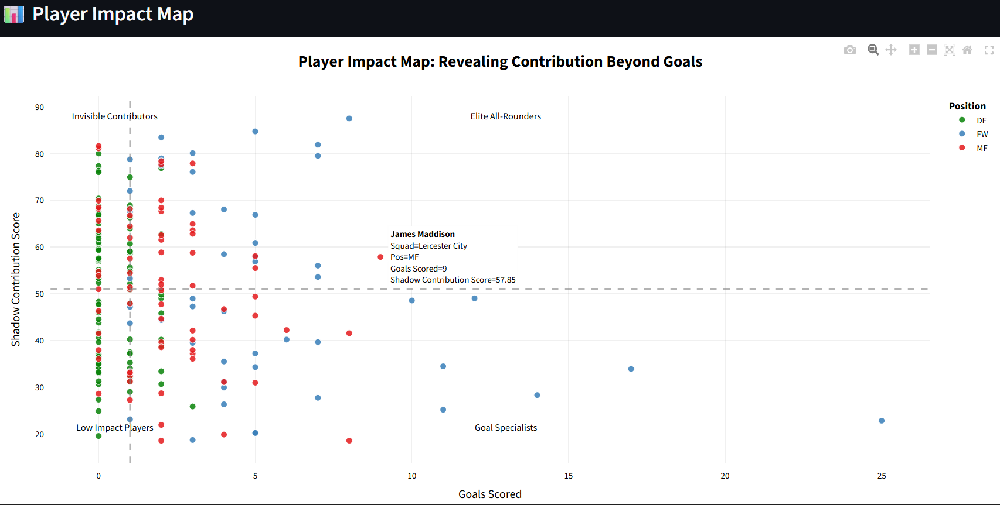
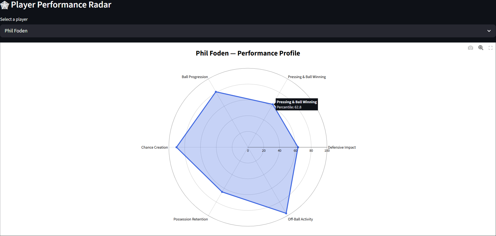
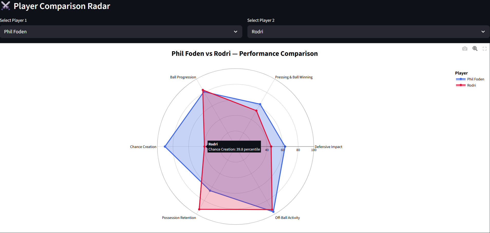

# ⚽ The Invisible 11  
### Football Player Impact Analyzer

A data analytics project that identifies football players whose contributions go beyond goals and assists using a custom metric called the **Shadow Contribution Score (SCS)**.

📊 Built using real-world Premier League (2022–23) data to uncover hidden player impact beyond traditional metrics.


## 📌 Project Overview

Traditional football metrics like goals and assists fail to capture the full impact of a player.

This project introduces the **Shadow Contribution Score (SCS)** — a composite metric designed to evaluate player contributions across multiple dimensions:

- Defensive actions    
- Ball progression    
- Chance creation    
- Possession retention    
- Pressing and ball recovery    
- Off-ball activity    

The system analyzes **Premier League 2022–23 players** and presents insights through an **interactive Streamlit dashboard**.


## 🌐 Live Demo

Coming soon (Streamlit Cloud deployment planned)


## 📊 Dashboard Visualizations

### Player Impact Map


### Player Performance Radar


### Player Comparison Radar



## 🚀 Features

- 🏆 **SCS Leaderboard**  
  Rank players based on overall contribution.

- 📊 **Player Impact Map**  
  Visualize Goals vs SCS to identify:
  - Invisible Contributors    
  - Elite All-Rounders    
  - Goal Specialists    
  - Low Impact Players    

- 🕸 **Player Performance Radar**  
  Analyze a player's strengths across six dimensions.

- ⚔️ **Player Comparison Radar**  
  Compare two players across all performance dimensions.

- 🕵️ **Invisible Contributors Identification**  
  Discover players with high impact but low goal output.


## 🧰 Tech Stack

- Python    
- Pandas    
- NumPy    
- Plotly    
- Streamlit    
- Scikit-learn (cosine similarity)  


## 📁 Project Structure

```
invisible-11/
│
├── .streamlit/
│   └── config.toml # Streamlit UI configuration
│
├── dashboard/
│   └── app.py # Main Streamlit dashboard application
│
├── data/
│   ├── raw/ # Original dataset
│   └── processed/ # Cleaned & SCS-ready dataset
│
├── notebooks/
│   ├── data_exploration.ipynb # Data cleaning & preprocessing
│   └── visualizations.ipynb # Feature engineering & plotting
│
├── outputs/ # Dashboard screenshots for README
│
├── src/ # Modular Python scripts (future scalability)
│
├── venv/ # Virtual environment (ignored in Git)
│
├── .gitignore
├── README.md
└── requirements.txt # Project dependencies
```


## 🖥 How to Run

Clone the repository:

```bash
git clone https://github.com/lokesh-sangwan/invisible-11.git
cd invisible-11
```

Install dependencies:

```bash
pip install -r requirements.txt
```

Run the dashboard:

```bash
streamlit run dashboard/app.py
```


### 🔄 Data Pipeline

- Raw Data    
- Data Cleaning & Filtering    
- Per-90 Normalization    
- Position-Based Normalization    
- Feature Engineering    
- Shadow Contribution Score (SCS)    
- Visualization & Dashboard    


## ⚙️ Key Design Decisions

- Per-90 normalization ensures fair comparison across players with different playing time  

- Minimum 900 minutes threshold removes small-sample bias  

- Position-based scaling accounts for different player roles  

- Percentile scaling (0–100) enables intuitive comparisons across metrics  


## 💡 Key Insight

Many high-impact players contribute significantly without scoring goals.

The **Shadow Contribution Score (SCS)** reveals these *"invisible contributors"* by capturing:

- Defensive contributions  

- Ball progression  

- Chance creation  

- Off-ball activity  

This allows for a more holistic evaluation of player performance beyond traditional statistics.


## 🔮 Future Improvements

- Add player similarity using cosine similarity  

- Extend analysis to multiple seasons  

- Include team-level analytics  

- Deploy dashboard publicly (Streamlit Cloud)  


## 📬 Contact

If you’d like to connect or discuss this project:

- GitHub: https://github.com/lokesh-sangwan